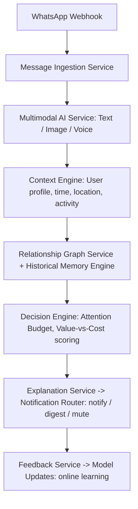

# AttentionOS: The AI-Powered WhatsApp Message Notification Router

**Product Requirements Document — Version 1.0**  
**Classification:** Confidential — Internal Product Proposal  
**Prepared For:** CEO, CTO, Head of AI, Investors  
**Prepared By:** Principal Product Manager, AI Products  
**Date:** August 1, 2026  

---

## 1. Executive Summary
AttentionOS is framed not as a notification classifier but as a **Digital Attention Operating System** that models human attention as a finite resource. Every WhatsApp message is evaluated for its attention cost relative to the user's cognitive state, relationship context, and a daily attention budget, rather than for content alone.

The core mechanism is an **Attention Budget**: a small daily ceiling on high-priority notifications, enforced as a hard constraint so upstream reasoning must prioritize ruthlessly rather than notify by default. Messages are routed through a multimodal pipeline (text, image, voice) that combines relationship context, trust signals, and historical memory into an explainable **notify / digest / mute** decision.

The product targets three problems at once: notification fatigue, scam exposure, and lack of personalization — treating attention explicitly as a budget to be spent, not an inbox to be filled.

---

## 2. Product Vision
To become the layer between humans and digital communication that understands attention well enough to route every message to the right moment, in the right form, with a clear explanation for why.

---

## 3. Mission Statement
Protect human attention from digital chaos by reasoning over context, relationships, and cognitive load to deliver only what matters, when it matters.

---

## 4. Product Philosophy

| Principle | Description |
|---|---|
| **Attention is Finite** | Notification volume should be treated as a limited daily budget, not an unlimited stream. |
| **Context is King** | A message's importance depends on who sent it, when, and what the user is doing. |
| **Explainability Builds Trust** | Every decision states why: notify, digest, or mute. |
| **Relationships Matter** | Family, work, and strangers warrant different treatment. |
| **Safety First** | Scams and fraud must be caught before they reach the user. |
| **Adaptive Learning** | The system should learn from every dismiss, act, and silence. |

---

## 5. Problem Analysis

* **The Attention Crisis:** Users facing high notification volume across fragmented tools report rising cognitive overload and decision fatigue, which can cause important messages — urgent family updates, payment reminders — to be missed amid noise.
* **The Scam Epidemic:** Meta reported removing 6.8 million WhatsApp accounts tied to criminal scam centers in the first half of 2025, and separately disrupted close to 8 million scam-linked accounts across Facebook and Instagram — underscoring that fraud on messaging platforms operates at meaningful scale. Common vectors include job scams, KYC fraud, UPI phishing, and fake investment schemes, and keyword-only filters routinely miss context-dependent or multimodal fraud (images, voice notes).
* **The Personalization Gap:** Current notification systems largely treat all users identically, without modeling individual attention limits or relationship context — no system today asks why a message matters to this specific user at this specific moment.

---

## 6. Existing Industry Problems

| Problem | Current Approach | Why It Fails |
|---|---|---|
| **Notification Overload** | Priority inboxes, mute buttons | Reactive, not predictive; requires manual configuration |
| **Scam Detection** | Keyword filters, user reports | Misses context, images, and voice notes; high false-negative rate |
| **Personalization** | Rule-based filters | Cannot adapt to changing behavior or relationships |
| **Explainability** | Black-box ML | Users don't trust decisions they can't understand |
| **Multimodal Understanding** | Text-only classifiers | Ignores images and voice notes that carry critical signals |

---

## 7. Market Opportunity

WhatsApp reports over 2 billion users globally, with a large concentration in India. Notification management and AI-driven scam detection are both active, growing categories without an established dominant player combining the two.

### Target Segments:
- **Individual users** — professionals, parents, students overwhelmed by notification volume
- **Businesses** — WhatsApp Business API users needing intelligent customer-message routing
- **Enterprises** — banks, e-commerce, healthcare requiring scam-safe communication channels

---

## 8. Competitive Landscape

| Competitor | Strength | Weakness |
|---|---|---|
| **Meta Scam Alerts** | Native WhatsApp integration at 2B-user scale | Text-only, reactive, no personalization |
| **On-device scam-detection apps (India-focused)** | On-device processing | Limited to scam detection, no routing |
| **Accessibility-overlay notification tools** | Real-time overlay, multi-app support | Depends on accessibility-service permissions, limited AI reasoning |
| **AI link-scanning bots** | AI-powered link scanning | Bot-based, not integrated into native routing |
| **Google Priority Inbox** | Email-focused, ML-based | Email only; no multimodal or attention-budget modeling |

---

## 9. Why Current Notification Systems Fail
- **No attention budget** — notifications are treated as unlimited rather than a limited daily allowance
- **Context blindness** — a payment reminder from a bank is treated the same as one from an unknown sender
- **Relationship ignorance** — family groups are muted uniformly, risking missed urgent messages
- **Scam vulnerability** — keyword filters miss image-based fraud, voice-note scams, and contextual phishing
- **Black-box decisions** — users don't understand why a message was notified or muted
- **Static personalization** — rules don't adapt to changing behavior or cognitive state

---

## 10. Product Objectives

| Objective | Metric | Target |
|---|---|---|
| Reduce notification fatigue | Daily notifications per user | ≤5 high-priority, ≤15 total |
| Improve scam detection | False-negative rate | <1% on multimodal scams |
| Increase user trust | Explainability satisfaction (survey) | ≥90% understand decisions |
| Personalize routing | Action relevance (click-through) | ≥85% acted-on notifications |
| Minimize false mutes | Urgent messages missed | <0.1% |

---

## 11. Success Metrics

**North Star:** Attention Efficiency Score — ratio of high-value actions taken to total notifications received.

### Secondary Metrics:
- **Notification budget utilization** — % of daily high-priority slots used meaningfully
- **Scam interception rate** — % of scams blocked before the user sees them
- **Explanation clarity score** — user-rated understanding of AI decisions
- **Relationship accuracy** — % of messages correctly routed by relationship context
- **Adaptive learning velocity** — time to personalize to new user behavior

---

## 12. User Personas

| Persona | Context & Needs |
|---|---|
| **Priya, 32** — Overwhelmed Professional (Bangalore) | 200+ daily messages; misses urgent client updates amid shopping offers; wants deep-work focus. |
| **Rajesh, 45** — Family Coordinator (Hoskote) | Muted family group risks missing a child's school emergency; annoyed by payment reminders from unknown senders. |
| **Ananya, 21** — Student (Mumbai) | Distracted by group chats; misses payment deadlines; receives job scams; wants to balance social life with focus. |
| **Vikram, 38** — Small Business Owner (Delhi) | Customer messages mixed with spam on WhatsApp Business; misses urgent orders; receives fake payment proof. |

---

## 13. User Journey

### Onboarding:
1. Install app and grant WhatsApp notification access
2. Set a daily high-priority notification budget
3. Tag contacts as Family, Work, Friends, or Unknown
4. Allow a short calibration period for the system to learn baseline behavior

### Daily Flow:
1. Message arrives (text, image, or voice note)
2. Multimodal engine scores attention cost, trust, and urgency
3. Decision: notify now, digest later, or mute
4. User sees a plain-language explanation for the decision
5. User's action or dismissal feeds back into the model

---

## 14. Pain Points & 15. User Stories

| User | Pain Point | Solution |
|---|---|---|
| **Priya** | Misses urgent client messages in noise | Relationship intelligence + attention budget |
| **Rajesh** | Scam payment reminders from unknown senders | Business trust engine + scam detection |
| **Ananya** | Distracted by group chats, misses deadlines | Context engine + adaptive learning |
| **Vikram** | Fake payment links from customers | Multimodal scam detection + explainable AI |

### Representative User Stories:
- *As Rajesh*, I want an urgent school message to reach me even in a muted family group, so I don't miss an emergency.
- *As Priya*, I want reminders from a verified bank to notify immediately while reminders from unknown senders are muted, so I avoid scams.
- *As Ananya*, I want a shopping offer digested rather than pushed if I've dismissed similar offers before.
- *As Vikram*, I want voice notes from unknown senders analyzed for scam patterns before they reach me.
- *As Rajesh*, I want images containing fake bill-payment links flagged before I can click them.

---

## 16. Product Differentiators & 17. Core Innovation

| Differentiator | Description |
|---|---|
| **Attention Budget Architecture** | A daily cap on high-priority notifications, forcing prioritization |
| **Digital Cognitive Twin** | A per-user model of attention patterns and cognitive load |
| **Relationship Graph Intelligence** | Dynamic trust/urgency scoring by contact, not just content |
| **Multimodal Scam Detection** | Text, image, and voice-note fraud analysis together |
| **Explainable Decision Timeline** | Every decision carries a transparent, evidence-backed reason |
| **Adaptive Notification DNA** | The system evolves from every dismiss, act, and silence |

---

## 18. Unique Selling Proposition

> *"Protect your attention like your bank account. AttentionOS budgets, invests, and optimizes every notification so you never miss what matters."*

---

## 19–21. Technical & AI Architecture

**Proposed Stack:** React Native (mobile), Next.js (dashboard), Node.js + FastAPI (backend), PyTorch/Hugging Face Transformers (AI pipeline), PostgreSQL + Redis + Neo4j (data), S3 + Pinecone (media & embeddings), AWS/GCP with Kubernetes (infrastructure).

---

## 22. AI Pipeline

1. **Ingestion** — extract `message_id`, `sender_id`, `group_id`, `timestamp`, `content`
2. **Multimodal encoding** — text via language encoder, images via vision encoder, voice via speech-to-text plus audio encoder
3. **Context encoding** — user profile, relationship graph, historical memory combined into a context vector
4. **Fusion & scoring** — combine embeddings, propagate relationship signals, apply attention-budget constraint, compute value-vs-attention-cost
5. **Decision head** — outputs action (notify/digest/mute), confidence, reason, evidence references
6. **Explanation generation** — language model produces a concise, human-readable reason
7. **Feedback loop** — user's act/dismiss updates the models

---

## 34. Notification Decision Matrix

| Message Type | Trust | Urgency | Budget | Action |
|---|---|---|---|---|
| **Bank payment reminder** | High | High | Available | Notify |
| **Unknown payment reminder** | Low | Medium | Available | Mute (scam risk) |
| **Family group message** | High | Low | Full | Digest |
| **Family emergency keyword** | High | High | Full | Notify (displaces) |
| **Shopping offer (dismissed before)** | Medium | Low | Available | Digest |
| **Verified business order** | High | High | Available | Notify |

---

## 40. AI Models (Proposed)

| Component | Approach |
|---|---|
| **Text encoder** | Transformer-based language encoder — text embeddings |
| **Image encoder** | Vision-transformer/contrastive model — visual embeddings |
| **Voice encoder** | Speech-to-text plus audio-feature model — transcription and audio embeddings |
| **Multimodal fusion** | Transformer fusion layer — combines text/image/voice |
| **Graph attention** | Graph attention network — relationship scoring |
| **Decision head** | Lightweight classifier — action, confidence, reason |
| **Explanation generator** | An instruction-tuned language model — human-readable reasons |
| **Scam classifier** | Fine-tuned text classifier — phishing detection |

---

## Appendix — Hackathon Implementation Status

| Capability | Status |
|---|---|
| **Rule-based routing (notify / digest / mute)** | Implemented |
| **Scam / phishing floor across all senders** | Implemented |
| **@-mention mute bypass** | Implemented |
| **Multimodal voice + image preprocessing (Gemini)** | Implemented |
| **Urgency keyword elevation** | Implemented |
| **Explainable decision trace** | Partial |
| **Relationship scoring (static lookup, not a learned graph)** | Partial |
| **Attention Budget (decaying daily threshold)** | Roadmap |
| **Digital Cognitive Twin (evolving per-user profile)** | Roadmap |
| **Neo4j relationship graph / Pinecone semantic memory** | Roadmap |
| **Production stack (Kubernetes, PostgreSQL, PyTorch)** | Roadmap — prototype runs on Gemini + rule engine |

---
